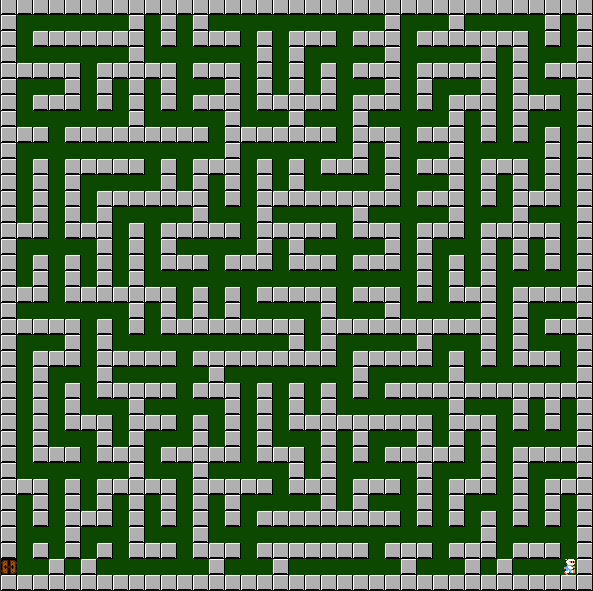

<!-- ABOUT THE PROJECT -->
## About The Project

# Pathfinding Algorithms

A demonstration of A*, BFS and DFS algorithms to find the path between two points on a bomberman maze while also avoiding obstacles.

<p align="center">
  
</p>
<!-- GETTING STARTED -->

## Code
This code was implemented using Python 3.8 (Anaconda) on Windows 10.

## Installation
### *Anaconda Installattion*
* Go to  https://www.anaconda.com/products/individual
* Download version for your system (We used Python 3.8  on 64bit Windows 10 )
* Install the platform
* Create a conda environment by typing:  ```conda create –n env_bomberman pip python=3.8 ```

### *Dependency Installattion*
Copy and paste following commands to install all packages (CPU version)
```sh
$ conda activate env_bomberman
$ pip install pygames
```

### Installation

1. Clone the repo
   ```sh
   git clone https://github.com/FurkanTornaci/bomberman-path-finding-ai
   ```

## Run the game
You can run the game by running this file ```main.py```. You can open up a terminal at the ```bomberman-path-finding-ai``` directory and type in
```sh
$ conda activate env_reproducibility & python main.py
```

